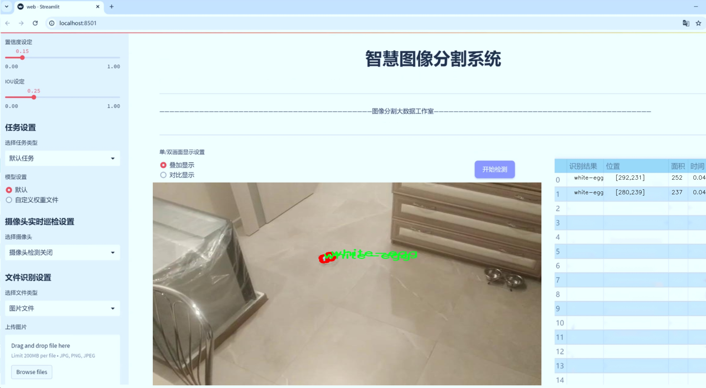
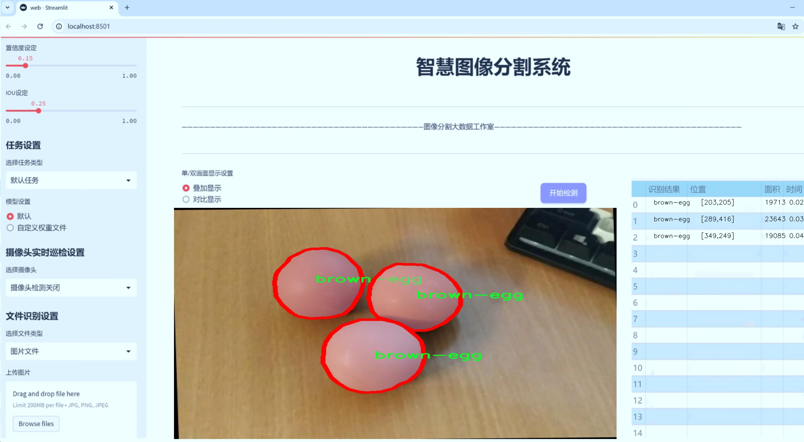
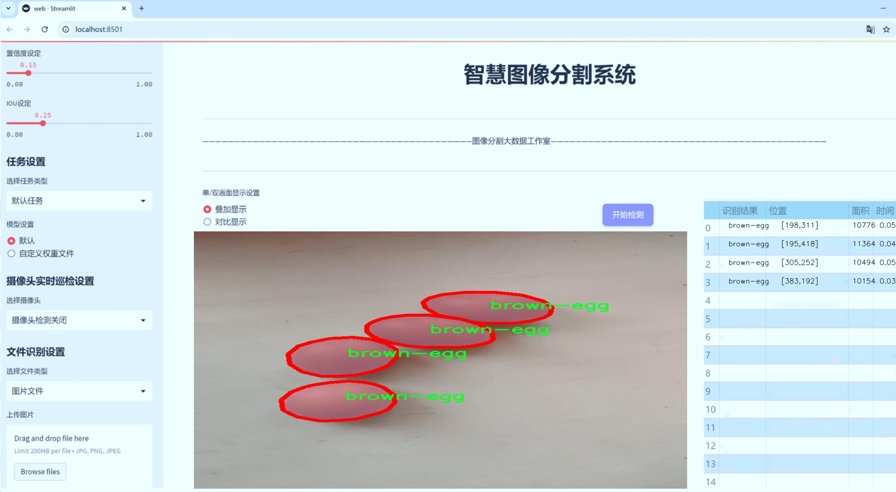
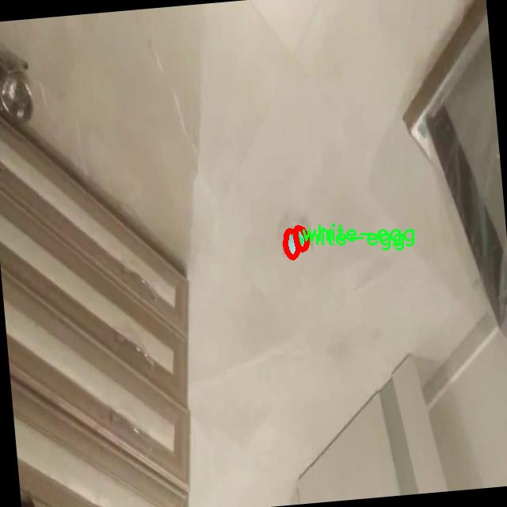
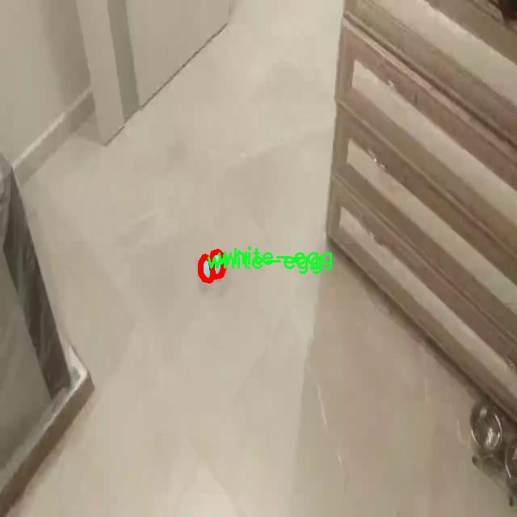
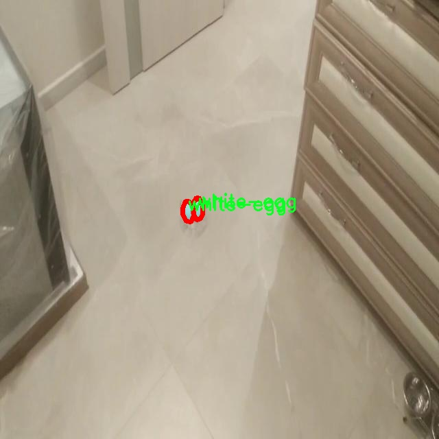
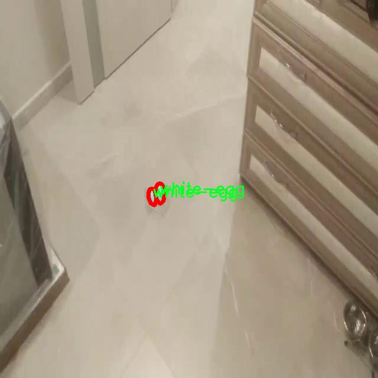
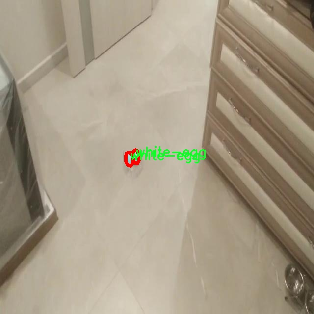

# 鸡蛋缺陷分割系统源码＆数据集分享
 [yolov8-seg-C2f-Parc＆yolov8-seg-C2f-DLKA等50+全套改进创新点发刊_一键训练教程_Web前端展示]

### 1.研究背景与意义

项目参考[ILSVRC ImageNet Large Scale Visual Recognition Challenge](https://gitee.com/YOLOv8_YOLOv11_Segmentation_Studio/projects)

项目来源[AAAI Global Al lnnovation Contest](https://kdocs.cn/l/cszuIiCKVNis)

研究背景与意义

随着全球食品安全意识的不断提升，鸡蛋作为一种重要的日常食品，其质量监控和缺陷检测显得尤为重要。鸡蛋在生产、运输和储存过程中，可能会受到多种因素的影响，导致其表面出现不同类型的缺陷，如污垢、裂纹等。这些缺陷不仅影响鸡蛋的外观质量，还可能对消费者的健康造成潜在威胁。因此，开发一种高效、准确的鸡蛋缺陷检测系统，能够在生产环节及时识别和剔除不合格产品，具有重要的现实意义。

近年来，计算机视觉技术的迅猛发展为农业产品的质量检测提供了新的解决方案。特别是基于深度学习的目标检测和分割技术，已经在多个领域取得了显著的成果。YOLO（You Only Look Once）系列模型因其高效的实时检测能力而广泛应用于物体检测任务。YOLOv8作为该系列的最新版本，结合了更为先进的网络结构和优化算法，能够在保证检测精度的同时，提高处理速度。因此，基于改进YOLOv8的鸡蛋缺陷分割系统的研究，不仅具有理论价值，也具有广泛的应用前景。

本研究所使用的数据集“eggs2”包含3000张图像，涵盖了六种不同类别的鸡蛋缺陷，包括脏污的棕色鸡蛋、完整的棕色鸡蛋、裂纹的棕色鸡蛋、完整的白色鸡蛋、裂纹的白色鸡蛋以及脏污的白色鸡蛋。这一丰富的数据集为模型的训练和验证提供了坚实的基础，使得模型能够学习到不同类型鸡蛋缺陷的特征。通过对这些图像进行实例分割，研究能够精确地识别出鸡蛋表面的缺陷区域，为后续的质量控制提供了重要依据。

在实际应用中，基于改进YOLOv8的鸡蛋缺陷分割系统可以实现自动化的质量检测，降低人工检测的成本和误差，提高生产效率。同时，该系统的实现将为鸡蛋生产企业提供科学的质量管理工具，帮助其在激烈的市场竞争中保持优势。此外，研究结果还可以为其他农产品的缺陷检测提供借鉴，推动农业智能化的发展。

综上所述，基于改进YOLOv8的鸡蛋缺陷分割系统的研究，不仅能够提高鸡蛋的质量检测效率，保障食品安全，还有助于推动农业领域的技术创新和智能化进程。通过本研究，期望能够为鸡蛋产业的可持续发展提供有力支持，同时为相关领域的研究提供新的思路和方法。

### 2.图片演示







##### 注意：由于此博客编辑较早，上面“2.图片演示”和“3.视频演示”展示的系统图片或者视频可能为老版本，新版本在老版本的基础上升级如下：（实际效果以升级的新版本为准）

  （1）适配了YOLOV8的“目标检测”模型和“实例分割”模型，通过加载相应的权重（.pt）文件即可自适应加载模型。

  （2）支持“图片识别”、“视频识别”、“摄像头实时识别”三种识别模式。

  （3）支持“图片识别”、“视频识别”、“摄像头实时识别”三种识别结果保存导出，解决手动导出（容易卡顿出现爆内存）存在的问题，识别完自动保存结果并导出到tempDir中。

  （4）支持Web前端系统中的标题、背景图等自定义修改，后面提供修改教程。

  另外本项目提供训练的数据集和训练教程,暂不提供权重文件（best.pt）,需要您按照教程进行训练后实现图片演示和Web前端界面演示的效果。

### 3.视频演示

[3.1 视频演示](https://www.bilibili.com/video/BV1oj1YYgEe1/)

### 4.数据集信息展示

##### 4.1 本项目数据集详细数据（类别数＆类别名）

nc: 6
names: ['brow-egg-dirty', 'brown-egg', 'brown-egg-crack', 'white-egg', 'white-egg-crack', 'white-egg-dirty']


##### 4.2 本项目数据集信息介绍

数据集信息展示

在本研究中，我们采用了名为“eggs2”的数据集，以支持对鸡蛋缺陷的分割系统进行训练，特别是针对改进版YOLOv8-seg模型的应用。该数据集专注于鸡蛋的多种状态和缺陷，涵盖了六个主要类别，旨在为计算机视觉任务提供丰富的标注数据，进而提升模型在实际应用中的准确性和鲁棒性。

“eggs2”数据集的类别数量为六，具体类别包括：brow-egg-dirty（脏的棕色鸡蛋）、brown-egg（棕色鸡蛋）、brown-egg-crack（裂纹棕色鸡蛋）、white-egg（白色鸡蛋）、white-egg-crack（裂纹白色鸡蛋）以及white-egg-dirty（脏的白色鸡蛋）。这些类别的选择反映了市场上常见的鸡蛋类型及其可能出现的缺陷状态，为模型的训练提供了多样化的样本，确保其能够适应不同的实际场景。

在数据集的构建过程中，研究团队对每一类鸡蛋进行了细致的标注，确保每个样本的缺陷特征能够被准确识别。通过对脏污、裂纹等不同缺陷的分类，数据集不仅帮助模型学习如何区分正常鸡蛋与有缺陷的鸡蛋，还增强了模型对各种环境因素的适应能力。例如，脏的棕色鸡蛋和脏的白色鸡蛋在外观上可能存在相似之处，但通过精确的标注，模型能够学会识别出细微的差别，从而提高其分割性能。

数据集的多样性也体现在样本的数量和质量上。为了确保模型的训练效果，数据集中的每个类别都包含了大量的图像，这些图像在不同的光照条件、拍摄角度和背景下进行采集。这种多样化的样本选择使得模型在面对真实世界中的复杂情况时，能够保持较高的识别率和分割精度。

此外，数据集的设计还考虑到了实际应用中的需求。例如，在食品安全和质量控制领域，快速而准确地识别鸡蛋的缺陷状态至关重要。通过使用“eggs2”数据集训练的YOLOv8-seg模型，能够实现对鸡蛋缺陷的实时监测，帮助生产商及时发现问题，减少损失，提高产品质量。

在模型训练过程中，我们将采用数据增强技术，以进一步提升模型的泛化能力。通过对“eggs2”数据集中的图像进行旋转、缩放、翻转等操作，能够有效增加训练样本的多样性，帮助模型更好地适应不同的输入情况。这一策略不仅有助于提高模型的准确性，还能增强其在面对未知数据时的鲁棒性。

综上所述，“eggs2”数据集为改进YOLOv8-seg的鸡蛋缺陷分割系统提供了坚实的基础。通过丰富的类别划分和高质量的标注，结合有效的数据增强策略，该数据集将显著提升模型在实际应用中的表现，推动鸡蛋质量检测技术的发展。











### 5.全套项目环境部署视频教程（零基础手把手教学）

[5.1 环境部署教程链接（零基础手把手教学）](https://www.bilibili.com/video/BV1jG4Ve4E9t/?vd_source=bc9aec86d164b67a7004b996143742dc)


[5.2 安装Python虚拟环境创建和依赖库安装视频教程链接（零基础手把手教学）](https://www.bilibili.com/video/BV1nA4VeYEze/?vd_source=bc9aec86d164b67a7004b996143742dc)

### 6.手把手YOLOV8-seg训练视频教程（零基础小白有手就能学会）

[6.1 手把手YOLOV8-seg训练视频教程（零基础小白有手就能学会）](https://www.bilibili.com/video/BV1cA4VeYETe/?vd_source=bc9aec86d164b67a7004b996143742dc)


按照上面的训练视频教程链接加载项目提供的数据集，运行train.py即可开始训练



     Epoch   gpu_mem       box       obj       cls    labels  img_size
     1/200     0G   0.01576   0.01955  0.007536        22      1280: 100%|██████████| 849/849 [14:42<00:00,  1.04s/it]
               Class     Images     Labels          P          R     mAP@.5 mAP@.5:.95: 100%|██████████| 213/213 [01:14<00:00,  2.87it/s]
                 all       3395      17314      0.994      0.957      0.0957      0.0843

     Epoch   gpu_mem       box       obj       cls    labels  img_size
     2/200     0G   0.01578   0.01923  0.007006        22      1280: 100%|██████████| 849/849 [14:44<00:00,  1.04s/it]
               Class     Images     Labels          P          R     mAP@.5 mAP@.5:.95: 100%|██████████| 213/213 [01:12<00:00,  2.95it/s]
                 all       3395      17314      0.996      0.956      0.0957      0.0845

     Epoch   gpu_mem       box       obj       cls    labels  img_size
     3/200     0G   0.01561    0.0191  0.006895        27      1280: 100%|██████████| 849/849 [10:56<00:00,  1.29it/s]
               Class     Images     Labels          P          R     mAP@.5 mAP@.5:.95: 100%|███████   | 187/213 [00:52<00:00,  4.04it/s]
                 all       3395      17314      0.996      0.957      0.0957      0.0845


### 7.50+种全套YOLOV8-seg创新点代码加载调参视频教程（一键加载写好的改进模型的配置文件）

[7.1 50+种全套YOLOV8-seg创新点代码加载调参视频教程（一键加载写好的改进模型的配置文件）](https://www.bilibili.com/video/BV1Hw4VePEXv/?vd_source=bc9aec86d164b67a7004b996143742dc)

### 8.YOLOV8-seg图像分割算法原理

原始YOLOv8-seg算法原理

YOLOv8-seg算法是YOLO系列的最新进展，专注于目标检测与分割任务的结合。作为一种先进的计算机视觉技术，YOLOv8-seg不仅继承了YOLO系列的高效性和实时性，还在此基础上引入了语义分割的能力，使得模型能够在更复杂的场景中进行更为精细的目标识别和定位。其核心思想是将目标检测与分割视为一个统一的任务，通过一个单一的神经网络模型同时完成目标的边界框预测和像素级的分割。

YOLOv8-seg的网络结构依然由主干网络、特征增强网络和检测头组成。主干网络采用了CSP（Cross Stage Partial）结构，这种设计能够有效减轻模型的计算负担，同时保持特征提取的精度。CSP结构通过将特征图分成多个部分并在不同的路径中进行处理，从而增强了网络的表达能力，减少了梯度消失的风险。这样的设计使得YOLOv8-seg在处理复杂场景时，能够更好地捕捉到目标的细节信息。

在特征增强网络部分，YOLOv8-seg引入了PAN-FPN（Path Aggregation Network - Feature Pyramid Network）的思想。这一结构通过多尺度特征的融合，增强了模型对不同尺度目标的感知能力。PAN-FPN通过上下采样和特征拼接的方式，将来自不同层次的特征图进行有效结合，从而提升了模型在目标检测和分割任务中的表现。通过这种方式，YOLOv8-seg能够在保持高效性的同时，获得更为丰富的上下文信息，为后续的目标检测和分割提供了坚实的基础。

检测头部分，YOLOv8-seg采用了解耦头（Decoupled Head）结构，将分类和回归任务分开处理。这一创新设计使得模型能够更专注于每个任务，避免了以往耦合头在复杂场景下可能出现的定位不准和分类错误的问题。通过解耦，YOLOv8-seg能够更好地处理目标的边界框回归和类别预测，从而提高了整体的检测精度。

YOLOv8-seg的另一个显著特点是其采用了Anchor-free的目标检测方法。这种方法不再依赖于预先定义的锚点框，而是通过回归的方式直接预测目标的位置和大小。这一设计的优势在于，传统的锚点框方法往往需要根据不同目标的尺度和形状进行繁琐的调整，而YOLOv8-seg通过直接预测目标的边界框，能够更快速地聚焦于目标位置的邻近点，使得预测框更接近于实际的边界框区域。这种灵活性不仅提升了检测速度，也提高了模型在复杂环境下的适应能力。

在训练过程中，YOLOv8-seg引入了新的损失函数策略，结合了变焦损失和完美交并比损失，以实现更为精确的目标检测与分割。变焦损失通过动态调整样本的权重，使得模型在训练时能够更关注难以检测的目标，从而提升了模型的鲁棒性和泛化能力。同时，完美交并比损失则在边界框的回归过程中，提供了更为精细的优化方向，使得模型在定位精度上得到了显著提升。

此外，YOLOv8-seg在数据预处理阶段也进行了多项创新，采用了Mosaic数据增强、自适应图片缩放和灰度填充等技术。这些技术不仅提高了模型的训练效率，还增强了模型对不同场景和光照条件的适应能力，使得YOLOv8-seg在实际应用中能够表现出色。

综上所述，YOLOv8-seg算法通过对YOLO系列的多项改进，结合了目标检测与分割的优势，形成了一种高效、准确的计算机视觉解决方案。其创新的网络结构、灵活的Anchor-free设计以及先进的损失函数策略，使得YOLOv8-seg在处理复杂场景时，能够更好地识别和分割目标，满足了实时检测的需求。随着YOLOv8-seg的不断发展和应用，未来在智能监控、自动驾驶、无人机巡检等领域，其潜力将得到进一步的挖掘和实现。


### 9.系统功能展示（检测对象为举例，实际内容以本项目数据集为准）

图9.1.系统支持检测结果表格显示

  图9.2.系统支持置信度和IOU阈值手动调节

  图9.3.系统支持自定义加载权重文件best.pt(需要你通过步骤5中训练获得)

  图9.4.系统支持摄像头实时识别

  图9.5.系统支持图片识别

  图9.6.系统支持视频识别

  图9.7.系统支持识别结果文件自动保存

  图9.8.系统支持Excel导出检测结果数据


### 10.50+种全套YOLOV8-seg创新点原理讲解（非科班也可以轻松写刊发刊，V11版本正在科研待更新）

#### 10.1 由于篇幅限制，每个创新点的具体原理讲解就不一一展开，具体见下列网址中的创新点对应子项目的技术原理博客网址【Blog】：


[10.1 50+种全套YOLOV8-seg创新点原理讲解链接](https://gitee.com/qunmasj/good)

#### 10.2 部分改进模块原理讲解(完整的改进原理见上图和技术博客链接)【如果此小节的图加载失败可以通过CSDN或者Github搜索该博客的标题访问原始博客，原始博客图片显示正常】
### 可变性卷积DCN简介
卷积神经网络由于其构建模块中固定的几何结构，本质上受限于模型几何变换。为了提高卷积神经网络的转换建模能力，《Deformable Convolutional Networks》作者提出了两个模块：可变形卷积（deformable convolution）和可变形RoI池（deformable RoI pooling）。这两个模块均基于用额外的偏移来增加模块中的空间采样位置以及从目标任务中学习偏移的思想，而不需要额外的监督。

第一次证明了在深度神经网络中学习密集空间变换（dense spatial transformation）对于复杂的视觉任务是有效的

视觉识别中的一个关键挑战是如何适应对象比例、姿态、视点和零件变形中的几何变化或模型几何变换。一般有两种方法实现：
1）建立具有足够期望变化的训练数据集。这通常通过增加现有的数据样本来实现，例如通过仿射变换。但是训练成本昂贵而且模型参数庞大。
2）使用变换不变（transformation-invariant）的特征和算法。比如比较有名的SIFT(尺度不变特征变换)便是这一类的代表算法。

但以上的方法有两个缺点：
1）几何变换被假定为固定的和已知的，这些先验知识被用来扩充数据，设计特征和算法。为此，这个假设阻止了对具有未知几何变换的新任务的推广，从而导致这些几何变换可能没有被正确建模。
2）对于不变特征和算法进行手动设计，对于过于复杂的变换可能是困难的或不可行的。

卷积神经网络本质上局限于模拟大型未知转换。局限性源于CNN模块的固定几何结构：卷积单元在固定位置对输入特征图进行采样；池化层以固定比率降低特征矩阵分辨率；RoI（感兴趣区域）池化层将RoI分成固定的空间箱（spatial bins）等。缺乏处理几何变换的内部机制。

这种内部机制的缺乏会导致一些问题，举个例子。同一个CNN层中所有激活单元的感受野大小是相同的，但是这是不可取的。因为不同的位置可能对应于具有不同尺度或变形的对象，所以尺度或感受野大小的自适应确定对于具有精细定位的视觉识别是渴望的。

对于这些问题，作者提出了两个模块提高CNNs对几何变换建模的能力。


deformable convolution（可变形卷积）
将2D偏移量添加到标准卷积中的常规网格采样位置，使得采样网格能够自由变形。通过额外的卷积层，从前面的特征映射中学习偏移。因此，变形采用局部、密集和自适应的方式取决于输入特征。


deformable RoI pooling（可变形RoI池化）
为先前RoI池化的常规库（bin）分区中的每个库位置（bin partition）增加了一个偏移量。类似地，偏移是从前面的特征图和感兴趣区域中学习的，从而能够对具有不同形状的对象进行自适应部件定位（adaptive part localization）。

#### Deformable Convolutional Networks
Deformable Convolution
2D卷积由两个步骤组成：
1）在输入特征图x xx上使用规则网格R RR进行采样。
2）把这些采样点乘不同权重w ww后相加。

网格R定义感受野大小和扩张程度，比如内核大小为3x3，扩张程度为1的网格R可以表示为：
R = { ( − 1 , − 1 ) , ( − 1 , 0 ) , … , ( 0 , 1 ) , ( 1 , 1 ) } R = \{(-1,-1),(-1,0),\dots,(0,1),(1,1)\}
R={(−1,−1),(−1,0),…,(0,1),(1,1)}

​
 一般为小数，使用双线性插值进行处理。（把小数坐标分解到相邻的四个整数坐标点来计算结果）


具体操作如图所示：


首先对输入特征层进行一个普通的3x3卷积处理得到偏移域（offset field）。偏移域特征图具有与输入特征图相同的空间分辨率，channels维度2N对应于N个2D（xy两个方向）偏移。其中的N是原输入特征图上所具有的N个channels，也就是输入输出channels保持不变，这里xy两个channels分别对输出特征图上的一个channels进行偏移。确定采样点后就通过与相对应的权重w点乘相加得到输出特征图上该点最终值。

前面也提到过，由于这里xy两个方向所训练出来的偏移量一般来说是一个小数，那么为了得到这个点所对应的数值，会采用双线性插值的方法，从最近的四个邻近坐标点中计算得到该偏移点的数值，公式如下：


具体推理过程见：双线性插值原理

#### Deformable RoI Poolingb
所有基于区域提议（RPN）的对象检测方法都使用RoI池话处理，将任意大小的输入矩形区域转换为固定大小的特征图。


 一般为小数，需要使用双线性插值进行处理。


具体操作如图所示：


当时看这个部分的时候觉得有些突兀，明明RoI池化会将特征层转化为固定尺寸的区域。其实，我个人觉得，这个部分与上述的可变性卷积操作是类似的。这里同样是使用了一个普通的RoI池化操作，进行一些列处理后得到了一个偏移域特征图，然后重新作用于原来的w × H w \times Hw×H的RoI。只不过这里不再是规律的逐行逐列对每个格子进行池化，而是对于格子进行偏移后再池化处理。

#### Postion﹣Sensitive RoI Pooling
除此之外，论文还提出一种PS RoI池化（Postion﹣Sensitive RoI Pooling）。不同于上述可变形RoI池化中的全连接过程，这里使用全卷积替换。

具体操作如图所示：


首先，对于原来的特征图来说，原本是将输入特征图上的RoI区域分成k × k k\times kk×k个bin。而在这里，则是将输入特征图进行卷积操作，分别得到一个channels为k 2 ( C + 1 ) k^{2}(C+1)k (C+1)的得分图（score maps）和一个channels为2 k 2 ( C + 1 ) 2k{2}(C+1)2k 2 (C+1)的偏移域（offset fields），这两个特征矩阵的宽高是与输入特征矩阵相同的。其中，得分图的channels中，k × k k \times kk×k分别表示的是每一个网格，C CC表示的检测对象的类别数目，1表示背景。而在偏移域中的2表示xy两个方向的偏移。
也就是说，在PS RoI池化中，对于RoI的每一个网格都独自占一个通道形成一层得分图，然后其对于的偏移量占两个通道。offset fields得到的偏移是归一化后的偏移，需要通过和deformable RoI pooling中一样的变换方式得到∆ p i j ∆p_{ij}∆p ij，然后对每层得分图进行偏移池化处理。最后处理完的结果就对应着最后输出的一个网格。所以其包含了位置信息。

原文论述为：


#### Understanding Deformable ConvNets
当可变形卷积叠加时，复合变形的效果是深远的。如图所示：


ps：a是标准卷积的固定感受野，b是可变形卷积的适应性感受野。

感受野和标准卷积中的采样位置在整个顶部特征图上是固定的(左)。在可变形卷积中，它们根据对象的比例和形状进行自适应调整(右)。


### 11.项目核心源码讲解（再也不用担心看不懂代码逻辑）

#### 11.1 ultralytics\models\rtdetr\train.py

以下是经过简化和注释的核心代码部分，保留了最重要的功能和逻辑：

```python
# Ultralytics YOLO 🚀, AGPL-3.0 license

import torch
from copy import copy
from ultralytics.models.yolo.detect import DetectionTrainer
from ultralytics.nn.tasks import RTDETRDetectionModel
from ultralytics.utils import RANK, colorstr
from .val import RTDETRDataset, RTDETRValidator

class RTDETRTrainer(DetectionTrainer):
    """
    RT-DETR模型的训练类，扩展了YOLO的DetectionTrainer类，以适应RT-DETR的特定特性和架构。
    该模型利用视觉变换器，具有IoU感知查询选择和可适应的推理速度等能力。
    """

    def get_model(self, cfg=None, weights=None, verbose=True):
        """
        初始化并返回一个用于目标检测任务的RT-DETR模型。

        Args:
            cfg (dict, optional): 模型配置，默认为None。
            weights (str, optional): 预训练模型权重的路径，默认为None。
            verbose (bool): 如果为True，则启用详细日志，默认为True。

        Returns:
            (RTDETRDetectionModel): 初始化后的模型。
        """
        # 创建RT-DETR检测模型
        model = RTDETRDetectionModel(cfg, nc=self.data['nc'], verbose=verbose and RANK == -1)
        if weights:
            model.load(weights)  # 加载预训练权重
        return model

    def build_dataset(self, img_path, mode='val', batch=None):
        """
        构建并返回用于训练或验证的RT-DETR数据集。

        Args:
            img_path (str): 包含图像的文件夹路径。
            mode (str): 数据集模式，'train'或'val'。
            batch (int, optional): 矩形训练的批量大小，默认为None。

        Returns:
            (RTDETRDataset): 特定模式的数据集对象。
        """
        # 创建RT-DETR数据集
        return RTDETRDataset(
            img_path=img_path,
            imgsz=self.args.imgsz,
            batch_size=batch,
            augment=mode == 'train',  # 训练模式下进行数据增强
            hyp=self.args,
            rect=False,
            cache=self.args.cache or None,
            prefix=colorstr(f'{mode}: '),  # 为日志添加前缀
            data=self.data
        )

    def get_validator(self):
        """
        返回适合RT-DETR模型验证的检测验证器。

        Returns:
            (RTDETRValidator): 模型验证器对象。
        """
        self.loss_names = 'giou_loss', 'cls_loss', 'l1_loss'  # 定义损失名称
        return RTDETRValidator(self.test_loader, save_dir=self.save_dir, args=copy(self.args))

    def preprocess_batch(self, batch):
        """
        预处理一批图像。缩放并将图像转换为浮点格式。

        Args:
            batch (dict): 包含一批图像、边界框和标签的字典。

        Returns:
            (dict): 预处理后的批次。
        """
        batch = super().preprocess_batch(batch)  # 调用父类的预处理方法
        bs = len(batch['img'])  # 批次大小
        batch_idx = batch['batch_idx']  # 批次索引
        gt_bbox, gt_class = [], []  # 初始化真实边界框和类别列表

        # 遍历每个图像，提取对应的边界框和类别
        for i in range(bs):
            gt_bbox.append(batch['bboxes'][batch_idx == i].to(batch_idx.device))  # 获取真实边界框
            gt_class.append(batch['cls'][batch_idx == i].to(device=batch_idx.device, dtype=torch.long))  # 获取真实类别

        return batch  # 返回预处理后的批次
```

### 代码分析
1. **类定义**: `RTDETRTrainer` 继承自 `DetectionTrainer`，专门用于RT-DETR模型的训练。
2. **模型初始化**: `get_model` 方法负责创建和加载RT-DETR模型。
3. **数据集构建**: `build_dataset` 方法用于创建训练或验证所需的数据集，支持数据增强。
4. **验证器获取**: `get_validator` 方法返回一个适合RT-DETR的验证器，用于模型的验证过程。
5. **批处理预处理**: `preprocess_batch` 方法对输入的图像批次进行预处理，包括缩放和类型转换，同时提取真实的边界框和类别信息。

这些核心部分构成了RT-DETR模型训练的基础，确保了模型的正确初始化、数据的准备和训练过程中的有效验证。

这个文件是一个用于训练RT-DETR模型的Python脚本，属于Ultralytics YOLO框架的一部分。RT-DETR是一种实时目标检测模型，由百度开发，结合了视觉变换器（Vision Transformers）和其他特性，能够实现高效的目标检测。

在文件开头，导入了一些必要的库和模块，包括PyTorch、DetectionTrainer、RTDETRDetectionModel以及数据集和验证器的相关类。接着定义了一个名为`RTDETRTrainer`的类，它继承自`DetectionTrainer`，并对YOLO的检测训练器进行了扩展，以适应RT-DETR模型的特定特性和架构。

类的文档字符串中提到了一些重要的注意事项，例如在RT-DETR中使用的`F.grid_sample`不支持`deterministic=True`参数，此外，使用自动混合精度（AMP）训练可能会导致NaN输出，并在二分图匹配过程中产生错误。

`RTDETRTrainer`类中定义了多个方法。`get_model`方法用于初始化并返回一个RT-DETR模型，接受模型配置、预训练权重路径和详细日志参数。若提供了权重路径，则会加载相应的预训练权重。

`build_dataset`方法用于构建并返回一个RT-DETR数据集，接受图像路径、模式（训练或验证）和批次大小作为参数。该方法根据模式的不同，决定是否进行数据增强，并返回一个`RTDETRDataset`对象。

`get_validator`方法返回一个适用于RT-DETR模型验证的验证器对象。它会设置损失名称，并创建一个`RTDETRValidator`实例，用于模型的验证过程。

`preprocess_batch`方法用于对一批图像进行预处理，包括缩放和转换为浮点格式。它首先调用父类的预处理方法，然后根据批次索引提取每个图像的真实边界框和类别，并将其转换为适当的设备和数据类型。

总体而言，这个文件的主要功能是定义一个训练RT-DETR模型的类，提供模型初始化、数据集构建、验证器获取和批次预处理等功能，为实时目标检测任务提供支持。

#### 11.2 ultralytics\nn\backbone\fasternet.py

以下是经过简化和注释的核心代码部分：

```python
import torch
import torch.nn as nn
from typing import List
from torch import Tensor

class Partial_conv3(nn.Module):
    """
    部分卷积层，用于处理输入特征图的不同部分。
    """
    def __init__(self, dim, n_div, forward):
        super().__init__()
        self.dim_conv3 = dim // n_div  # 卷积通道数
        self.dim_untouched = dim - self.dim_conv3  # 未处理的通道数
        self.partial_conv3 = nn.Conv2d(self.dim_conv3, self.dim_conv3, 3, 1, 1, bias=False)  # 3x3卷积

        # 根据前向传播方式选择相应的函数
        if forward == 'slicing':
            self.forward = self.forward_slicing
        elif forward == 'split_cat':
            self.forward = self.forward_split_cat
        else:
            raise NotImplementedError

    def forward_slicing(self, x: Tensor) -> Tensor:
        # 仅用于推理阶段
        x = x.clone()  # 保持原始输入不变，以便后续残差连接
        x[:, :self.dim_conv3, :, :] = self.partial_conv3(x[:, :self.dim_conv3, :, :])  # 处理部分通道
        return x

    def forward_split_cat(self, x: Tensor) -> Tensor:
        # 用于训练和推理阶段
        x1, x2 = torch.split(x, [self.dim_conv3, self.dim_untouched], dim=1)  # 按通道分割
        x1 = self.partial_conv3(x1)  # 处理分割出的部分
        x = torch.cat((x1, x2), 1)  # 合并处理后的部分和未处理部分
        return x


class MLPBlock(nn.Module):
    """
    多层感知机块，包含卷积层、归一化层和激活函数。
    """
    def __init__(self, dim, n_div, mlp_ratio, drop_path, layer_scale_init_value, act_layer, norm_layer, pconv_fw_type):
        super().__init__()
        self.dim = dim
        self.mlp_ratio = mlp_ratio
        self.drop_path = nn.Identity() if drop_path <= 0 else nn.Dropout(drop_path)  # 随机丢弃
        self.n_div = n_div

        mlp_hidden_dim = int(dim * mlp_ratio)  # 隐藏层维度

        # 定义MLP层
        mlp_layer: List[nn.Module] = [
            nn.Conv2d(dim, mlp_hidden_dim, 1, bias=False),
            norm_layer(mlp_hidden_dim),
            act_layer(),
            nn.Conv2d(mlp_hidden_dim, dim, 1, bias=False)
        ]
        self.mlp = nn.Sequential(*mlp_layer)  # 组合成顺序模块

        # 空间混合
        self.spatial_mixing = Partial_conv3(dim, n_div, pconv_fw_type)

    def forward(self, x: Tensor) -> Tensor:
        shortcut = x  # 残差连接
        x = self.spatial_mixing(x)  # 进行空间混合
        x = shortcut + self.drop_path(self.mlp(x))  # 添加残差
        return x


class FasterNet(nn.Module):
    """
    FasterNet模型的主类，包含多个阶段和嵌入层。
    """
    def __init__(self, in_chans=3, num_classes=1000, embed_dim=96, depths=(1, 2, 8, 2), mlp_ratio=2., n_div=4,
                 patch_size=4, patch_stride=4, drop_path_rate=0.1, norm_layer=nn.BatchNorm2d, act_layer=nn.ReLU):
        super().__init__()

        self.patch_embed = nn.Conv2d(in_chans, embed_dim, kernel_size=patch_size, stride=patch_stride, bias=False)  # 嵌入层

        # 构建各个阶段
        stages_list = []
        for i_stage in range(len(depths)):
            stage = MLPBlock(dim=int(embed_dim * 2 ** i_stage), n_div=n_div, mlp_ratio=mlp_ratio, drop_path=drop_path_rate,
                             layer_scale_init_value=0, norm_layer=norm_layer, act_layer=act_layer, pconv_fw_type='split_cat')
            stages_list.append(stage)

        self.stages = nn.Sequential(*stages_list)  # 将所有阶段组合成顺序模块

    def forward(self, x: Tensor) -> Tensor:
        x = self.patch_embed(x)  # 嵌入输入
        for stage in self.stages:
            x = stage(x)  # 通过每个阶段
        return x  # 返回最终输出


# 创建FasterNet模型的实例
if __name__ == '__main__':
    model = FasterNet()  # 实例化模型
    inputs = torch.randn((1, 3, 640, 640))  # 创建随机输入
    outputs = model(inputs)  # 前向传播
    print(outputs.size())  # 输出尺寸
```

### 代码说明：
1. **Partial_conv3**: 这个类实现了部分卷积操作，可以选择不同的前向传播方式（切片或拼接）。
2. **MLPBlock**: 这个类实现了一个多层感知机块，包含卷积、归一化和激活函数，并且可以选择是否使用残差连接。
3. **FasterNet**: 这个类是整个网络的主结构，包含多个阶段的MLP块和一个嵌入层。前向传播时会通过这些阶段处理输入。
4. **主程序**: 在主程序中实例化了FasterNet模型，并进行一次前向传播以测试模型的输出尺寸。

这个程序文件定义了一个名为 `FasterNet` 的深度学习模型，主要用于图像处理任务。该模型的设计灵感来源于高效的神经网络架构，适用于各种计算机视觉任务。代码中包含多个类和函数，下面是对其主要内容的详细说明。

首先，文件导入了一些必要的库，包括 PyTorch 和其他相关模块。然后，定义了一些基础组件，例如 `Partial_conv3`、`MLPBlock`、`BasicStage`、`PatchEmbed` 和 `PatchMerging`。这些组件是构建 `FasterNet` 模型的基础。

`Partial_conv3` 类实现了一种部分卷积操作，支持两种前向传播方式：切片（slicing）和拼接（split_cat）。这种设计允许在推理和训练过程中灵活处理输入数据。

`MLPBlock` 类实现了一个多层感知机（MLP）模块，包含了空间混合和残差连接的功能。该模块可以选择性地使用层级缩放（layer scale），以增强模型的表达能力。

`BasicStage` 类由多个 `MLPBlock` 组成，构成了模型的基本构建块。每个阶段可以有不同的深度和参数设置。

`PatchEmbed` 类用于将输入图像分割成不重叠的补丁，并将其嵌入到一个新的特征空间中。`PatchMerging` 类则用于在模型的不同阶段合并补丁，以减少特征图的尺寸。

`FasterNet` 类是整个模型的核心，负责整合所有的组件。它接受多个参数，包括输入通道数、类别数、嵌入维度、各阶段的深度等。模型的构建过程包括初始化补丁嵌入层、各个阶段的基本结构以及规范化层。通过这些设置，模型能够在不同的阶段提取特征，并在最后输出多个阶段的特征图。

在文件的最后部分，定义了一些函数，如 `fasternet_t0`、`fasternet_t1` 等，这些函数用于加载不同配置的 `FasterNet` 模型，并可选择性地加载预训练权重。每个函数都从指定的 YAML 配置文件中读取参数，并创建相应的模型实例。

最后，`if __name__ == '__main__':` 部分用于测试模型的功能，创建一个 `FasterNet` 实例，并输出模型的特征通道大小以及对随机输入的处理结果。

整体而言，这个程序文件实现了一个灵活且高效的神经网络架构，适用于多种计算机视觉任务，且通过模块化设计使得模型的构建和扩展变得更加方便。

#### 11.3 ultralytics\trackers\track.py

以下是经过简化和注释的核心代码部分：

```python
# 导入必要的库
from functools import partial
import torch
from ultralytics.utils import IterableSimpleNamespace, yaml_load
from ultralytics.utils.checks import check_yaml
from .bot_sort import BOTSORT
from .byte_tracker import BYTETracker

# 定义跟踪器映射字典
TRACKER_MAP = {'bytetrack': BYTETracker, 'botsort': BOTSORT}

def on_predict_start(predictor, persist=False):
    """
    在预测开始时初始化对象跟踪器。

    参数:
        predictor (object): 需要初始化跟踪器的预测器对象。
        persist (bool, optional): 如果跟踪器已存在，是否保持它们。默认为 False。

    异常:
        AssertionError: 如果 tracker_type 不是 'bytetrack' 或 'botsort'。
    """
    # 如果预测器已经有跟踪器且需要保持，则直接返回
    if hasattr(predictor, 'trackers') and persist:
        return
    
    # 检查并加载跟踪器配置
    tracker = check_yaml(predictor.args.tracker)
    cfg = IterableSimpleNamespace(**yaml_load(tracker))
    
    # 确保跟踪器类型是支持的类型
    assert cfg.tracker_type in ['bytetrack', 'botsort'], \
        f"只支持 'bytetrack' 和 'botsort'，但得到了 '{cfg.tracker_type}'"
    
    # 初始化跟踪器列表
    trackers = []
    for _ in range(predictor.dataset.bs):  # 对于每个批次
        # 创建对应类型的跟踪器并添加到列表中
        tracker = TRACKER_MAP[cfg.tracker_type](args=cfg, frame_rate=30)
        trackers.append(tracker)
    
    # 将跟踪器列表赋值给预测器
    predictor.trackers = trackers

def on_predict_postprocess_end(predictor):
    """后处理检测到的框并更新对象跟踪。"""
    bs = predictor.dataset.bs  # 批次大小
    im0s = predictor.batch[1]  # 获取原始图像
    for i in range(bs):
        det = predictor.results[i].boxes.cpu().numpy()  # 获取检测结果
        if len(det) == 0:  # 如果没有检测到对象，跳过
            continue
        
        # 更新跟踪器并获取跟踪结果
        tracks = predictor.trackers[i].update(det, im0s[i])
        if len(tracks) == 0:  # 如果没有跟踪到对象，跳过
            continue
        
        idx = tracks[:, -1].astype(int)  # 获取跟踪索引
        predictor.results[i] = predictor.results[i][idx]  # 更新检测结果
        predictor.results[i].update(boxes=torch.as_tensor(tracks[:, :-1]))  # 更新框信息

def register_tracker(model, persist):
    """
    注册跟踪回调到模型，以便在预测期间进行对象跟踪。

    参数:
        model (object): 需要注册跟踪回调的模型对象。
        persist (bool): 如果跟踪器已存在，是否保持它们。
    """
    # 添加预测开始时的回调
    model.add_callback('on_predict_start', partial(on_predict_start, persist=persist))
    # 添加后处理结束时的回调
    model.add_callback('on_predict_postprocess_end', on_predict_postprocess_end)
```

### 代码说明：
1. **导入模块**：导入了必要的库和模块，用于实现对象跟踪功能。
2. **跟踪器映射**：定义了一个字典，将跟踪器名称映射到具体的跟踪器类。
3. **`on_predict_start` 函数**：在预测开始时初始化跟踪器，检查配置文件，确保跟踪器类型有效，并为每个批次创建相应的跟踪器实例。
4. **`on_predict_postprocess_end` 函数**：在预测后处理阶段，更新检测结果并与跟踪器的输出进行整合，确保输出结果包含跟踪信息。
5. **`register_tracker` 函数**：将跟踪回调函数注册到模型中，以便在预测过程中调用这些函数。

这个程序文件是Ultralytics YOLO框架中的一个跟踪器模块，主要用于在目标检测过程中实现对象跟踪功能。文件中导入了一些必要的库和模块，包括`torch`和一些Ultralytics的工具函数。它定义了一些跟踪器（如BYTETracker和BOTSORT）以及与预测过程相关的回调函数。

首先，`TRACKER_MAP`字典将跟踪器类型与相应的类进行映射，支持的跟踪器有`bytetrack`和`botsort`。接下来，`on_predict_start`函数用于在预测开始时初始化跟踪器。它接收一个预测器对象和一个可选的布尔参数`persist`，用于指示是否保留已存在的跟踪器。如果预测器已经有跟踪器且`persist`为真，则直接返回。否则，它会检查配置文件中的跟踪器类型，并确保其为支持的类型之一。如果通过检查，函数会为每个批次的样本创建相应的跟踪器实例，并将其存储在预测器的`trackers`属性中。

接着，`on_predict_postprocess_end`函数在检测框后处理结束时被调用。它的作用是更新检测到的目标框，并结合对象跟踪的结果。函数首先获取批次大小和输入图像，然后遍历每个样本的检测结果。如果检测结果为空，则跳过该样本。否则，它会调用相应的跟踪器更新方法，并获取跟踪结果。如果有有效的跟踪结果，函数会根据跟踪的索引更新预测结果，并将新的边界框信息存储回预测结果中。

最后，`register_tracker`函数用于将跟踪回调函数注册到模型中，以便在预测过程中调用。它接收模型对象和一个布尔参数`persist`，并将`on_predict_start`和`on_predict_postprocess_end`函数作为回调添加到模型中。这使得在模型进行预测时，可以自动处理跟踪的初始化和后处理。

整体来看，这个文件实现了在目标检测过程中集成对象跟踪的功能，确保在每次预测时都能正确初始化和更新跟踪器，从而提高检测的准确性和连贯性。

#### 11.4 ultralytics\nn\extra_modules\ops_dcnv3\modules\__init__.py

以下是保留的核心代码部分，并附上详细的中文注释：

```python
# 导入DCNv3相关模块
from .dcnv3 import DCNv3, DCNv3_pytorch, DCNv3_DyHead

# 以上代码从当前包的dcnv3模块中导入了三个类或函数：
# 1. DCNv3：可能是一个深度可分离卷积的实现，用于提高卷积神经网络的性能。
# 2. DCNv3_pytorch：可能是DCNv3在PyTorch框架下的实现，方便在PyTorch中使用。
# 3. DCNv3_DyHead：可能是一个动态头部的实现，可能用于目标检测或分割任务中。
```

这段代码的核心在于从dcnv3模块中导入了与DCNv3相关的功能，以便在后续的模型构建或训练中使用。

这个程序文件是一个Python模块的初始化文件，位于`ultralytics/nn/extra_modules/ops_dcnv3/modules/`目录下。文件的开头包含了一些版权信息，表明该代码是由OpenGVLab在2022年创建的，并且是根据MIT许可证进行授权的。这意味着用户可以自由使用、修改和分发该代码，只要遵循许可证的条款。

在文件的主体部分，使用了`from`语句导入了三个类或函数：`DCNv3`、`DCNv3_pytorch`和`DCNv3_DyHead`。这些类或函数来自同一目录下的`dcnv3`模块。通过这种方式，用户在导入这个模块时，可以直接使用这三个导入的组件，而不需要单独导入`dcnv3`模块。这种做法有助于简化模块的使用，提高代码的可读性和可维护性。

总体来看，这个文件的主要作用是作为一个模块的入口，整合并暴露特定的功能，以便于其他部分的代码能够方便地访问和使用这些功能。

#### 11.5 ultralytics\utils\loss.py

以下是代码中最核心的部分，并附上详细的中文注释：

```python
import torch
import torch.nn as nn
import torch.nn.functional as F

class BboxLoss(nn.Module):
    def __init__(self, reg_max, use_dfl=False):
        """初始化BboxLoss模块，设置最大正则化值和DFL选项。"""
        super().__init__()
        self.reg_max = reg_max  # 最大正则化值
        self.use_dfl = use_dfl  # 是否使用分布焦点损失
        self.nwd_loss = False  # 是否使用NWD损失
        self.iou_ratio = 0.5  # IoU损失的比例

    def forward(self, pred_dist, pred_bboxes, anchor_points, target_bboxes, target_scores, target_scores_sum, fg_mask):
        """计算IoU损失和DFL损失。"""
        weight = target_scores.sum(-1)[fg_mask].unsqueeze(-1)  # 计算权重
        iou = bbox_iou(pred_bboxes[fg_mask], target_bboxes[fg_mask], xywh=False, CIoU=True)  # 计算IoU

        # IoU损失
        loss_iou = ((1.0 - iou) * weight).sum() / target_scores_sum
        
        # DFL损失
        if self.use_dfl:
            target_ltrb = bbox2dist(anchor_points, target_bboxes, self.reg_max)  # 将目标框转换为分布
            loss_dfl = self._df_loss(pred_dist[fg_mask].view(-1, self.reg_max + 1), target_ltrb[fg_mask]) * weight
            loss_dfl = loss_dfl.sum() / target_scores_sum
        else:
            loss_dfl = torch.tensor(0.0).to(pred_dist.device)  # 如果不使用DFL，损失为0

        return loss_iou, loss_dfl  # 返回IoU损失和DFL损失

    @staticmethod
    def _df_loss(pred_dist, target):
        """计算分布焦点损失（DFL）。"""
        tl = target.long()  # 目标左边界
        tr = tl + 1  # 目标右边界
        wl = tr - target  # 左边权重
        wr = 1 - wl  # 右边权重
        # 返回左边和右边的交叉熵损失的加权和
        return (F.cross_entropy(pred_dist, tl.view(-1), reduction='none').view(tl.shape) * wl +
                F.cross_entropy(pred_dist, tr.view(-1), reduction='none').view(tl.shape) * wr).mean(-1, keepdim=True)

class v8DetectionLoss:
    """计算检测损失的类。"""

    def __init__(self, model):
        """初始化v8DetectionLoss，设置模型相关属性和BCE损失函数。"""
        device = next(model.parameters()).device  # 获取模型设备
        h = model.args  # 超参数

        m = model.model[-1]  # Detect()模块
        self.bce = nn.BCEWithLogitsLoss(reduction='none')  # 二元交叉熵损失
        self.hyp = h  # 超参数
        self.stride = m.stride  # 模型步幅
        self.nc = m.nc  # 类别数量
        self.reg_max = m.reg_max  # 最大正则化值
        self.device = device  # 设备

        self.bbox_loss = BboxLoss(m.reg_max - 1).to(device)  # 初始化边界框损失

    def __call__(self, preds, batch):
        """计算损失并返回。"""
        loss, batch_size = self.compute_loss(preds, batch)  # 计算损失
        return loss.sum() * batch_size, loss.detach()  # 返回总损失和分离的损失

    def compute_loss(self, preds, batch):
        """计算边界框、类别和DFL的损失。"""
        loss = torch.zeros(3, device=self.device)  # box, cls, dfl
        feats = preds[1] if isinstance(preds, tuple) else preds  # 获取特征
        pred_distri, pred_scores = torch.cat([xi.view(feats[0].shape[0], self.nc, -1) for xi in feats], 2).split(
            (self.reg_max * 4, self.nc), 1)  # 分割预测分布和分数

        # 目标处理
        targets = torch.cat((batch['batch_idx'].view(-1, 1), batch['cls'].view(-1, 1), batch['bboxes']), 1)
        gt_labels, gt_bboxes = targets.split((1, 4), 2)  # 类别和边界框

        # 计算边界框损失
        pred_bboxes = self.bbox_decode(anchor_points, pred_distri)  # 解码预测边界框
        if fg_mask.sum():  # 如果有前景
            target_bboxes /= stride_tensor  # 标准化目标边界框
            loss[0], loss[2] = self.bbox_loss(pred_distri, pred_bboxes, anchor_points, target_bboxes, target_scores, target_scores_sum, fg_mask)  # 计算损失

        return loss  # 返回损失
```

### 代码核心部分说明：
1. **BboxLoss类**：用于计算边界框的损失，包括IoU损失和分布焦点损失（DFL）。`forward`方法中计算了IoU损失，并根据是否使用DFL计算相应的损失。

2. **v8DetectionLoss类**：用于计算YOLOv8模型的检测损失。初始化时设置了模型参数和损失函数，`__call__`方法用于计算总损失，`compute_loss`方法计算具体的边界框损失和类别损失。

这些部分是YOLO模型训练中损失计算的核心，确保模型能够有效地学习到目标检测任务。

这个程序文件是Ultralytics YOLO（You Only Look Once）模型的损失函数实现，主要用于目标检测、分割和关键点检测等任务。文件中定义了多个损失类，每个类负责计算特定类型的损失，以便在训练过程中优化模型的性能。

首先，`SlideLoss`类和`EMASlideLoss`类实现了滑动损失（Slide Loss）和指数移动平均滑动损失（EMA Slide Loss）。这两种损失通过调整损失的权重来适应不同的IoU（Intersection over Union）阈值，从而提高模型对不同难度样本的学习能力。

接下来，`VarifocalLoss`和`FocalLoss`类实现了变焦损失（Varifocal Loss）和焦点损失（Focal Loss）。这两种损失函数主要用于处理类别不平衡问题，通过调整损失的权重来强调难以分类的样本，从而提高模型的分类性能。

`BboxLoss`类负责计算边界框损失，包括IoU损失和分布焦点损失（DFL）。它通过计算预测边界框与真实边界框之间的IoU来评估模型的定位精度，并可以选择性地使用DFL来进一步优化边界框的预测。

`KeypointLoss`类用于计算关键点损失，主要用于姿态估计任务。它通过计算预测关键点与真实关键点之间的欧几里得距离来评估模型的关键点检测性能。

`v8DetectionLoss`类是一个综合性的损失类，负责计算目标检测任务中的所有损失，包括边界框损失、分类损失和DFL损失。它还实现了目标分配器（assigner），用于将预测结果与真实标签进行匹配。

`v8SegmentationLoss`类扩展了`v8DetectionLoss`，增加了对实例分割任务的支持，计算分割损失并结合目标检测损失。

`v8PoseLoss`类则专注于姿态估计任务，计算关键点位置和可见性损失，结合目标检测损失来优化模型的整体性能。

最后，`v8ClassificationLoss`类实现了简单的分类损失计算，适用于分类任务。

整体来看，这个文件通过定义多种损失函数，提供了灵活的损失计算机制，以适应不同的任务需求，从而帮助模型在训练过程中更好地学习和优化。

### 12.系统整体结构（节选）

### 整体功能和构架概括

Ultralytics框架是一个高效的计算机视觉库，主要用于目标检测、分割和跟踪等任务。该框架通过模块化设计，将不同的功能和组件分散在多个文件中，以便于管理和扩展。以下是各个文件的主要功能概述：

1. **训练模块** (`train.py`): 负责定义和管理RT-DETR模型的训练过程，包括模型初始化、数据集构建、验证器获取和批次预处理等功能。
2. **网络结构模块** (`fasternet.py`): 实现了FasterNet模型的构建，包含多个基础组件和模块，支持高效的图像处理任务。
3. **跟踪模块** (`track.py`): 集成了对象跟踪功能，提供了在目标检测过程中初始化和更新跟踪器的机制。
4. **初始化模块** (`__init__.py`): 作为DCNv3模块的入口，整合并暴露特定功能，以便于其他部分的代码访问。
5. **损失函数模块** (`loss.py`): 定义了多种损失函数，支持目标检测、分割和关键点检测等任务，帮助模型在训练过程中优化性能。

### 文件功能整理表

| 文件路径                                          | 功能描述                                                                                     |
|--------------------------------------------------|----------------------------------------------------------------------------------------------|
| `ultralytics/models/rtdetr/train.py`             | 定义RT-DETR模型的训练过程，包括模型初始化、数据集构建、验证器获取和批次预处理等功能。       |
| `ultralytics/nn/backbone/fasternet.py`          | 实现FasterNet模型的构建，包含多个基础组件和模块，支持高效的图像处理任务。                 |
| `ultralytics/trackers/track.py`                  | 集成对象跟踪功能，提供在目标检测过程中初始化和更新跟踪器的机制。                         |
| `ultralytics/nn/extra_modules/ops_dcnv3/modules/__init__.py` | 作为DCNv3模块的入口，整合并暴露特定功能，以便于其他部分的代码访问。                      |
| `ultralytics/utils/loss.py`                      | 定义多种损失函数，支持目标检测、分割和关键点检测等任务，帮助模型在训练过程中优化性能。   |

这个表格总结了每个文件的主要功能，展示了Ultralytics框架的模块化设计和各个组件之间的协作关系。

注意：由于此博客编辑较早，上面“11.项目核心源码讲解（再也不用担心看不懂代码逻辑）”中部分代码可能会优化升级，仅供参考学习，完整“训练源码”、“Web前端界面”和“50+种创新点源码”以“14.完整训练+Web前端界面+50+种创新点源码、数据集获取”的内容为准。

### 13.图片、视频、摄像头图像分割Demo(去除WebUI)代码

在这个博客小节中，我们将讨论如何在不使用WebUI的情况下，实现图像分割模型的使用。本项目代码已经优化整合，方便用户将分割功能嵌入自己的项目中。
核心功能包括图片、视频、摄像头图像的分割，ROI区域的轮廓提取、类别分类、周长计算、面积计算、圆度计算以及颜色提取等。
这些功能提供了良好的二次开发基础。

### 核心代码解读

以下是主要代码片段，我们会为每一块代码进行详细的批注解释：

```python
import random
import cv2
import numpy as np
from PIL import ImageFont, ImageDraw, Image
from hashlib import md5
from model import Web_Detector
from chinese_name_list import Label_list

# 根据名称生成颜色
def generate_color_based_on_name(name):
    ......

# 计算多边形面积
def calculate_polygon_area(points):
    return cv2.contourArea(points.astype(np.float32))

...
# 绘制中文标签
def draw_with_chinese(image, text, position, font_size=20, color=(255, 0, 0)):
    image_pil = Image.fromarray(cv2.cvtColor(image, cv2.COLOR_BGR2RGB))
    draw = ImageDraw.Draw(image_pil)
    font = ImageFont.truetype("simsun.ttc", font_size, encoding="unic")
    draw.text(position, text, font=font, fill=color)
    return cv2.cvtColor(np.array(image_pil), cv2.COLOR_RGB2BGR)

# 动态调整参数
def adjust_parameter(image_size, base_size=1000):
    max_size = max(image_size)
    return max_size / base_size

# 绘制检测结果
def draw_detections(image, info, alpha=0.2):
    name, bbox, conf, cls_id, mask = info['class_name'], info['bbox'], info['score'], info['class_id'], info['mask']
    adjust_param = adjust_parameter(image.shape[:2])
    spacing = int(20 * adjust_param)

    if mask is None:
        x1, y1, x2, y2 = bbox
        aim_frame_area = (x2 - x1) * (y2 - y1)
        cv2.rectangle(image, (x1, y1), (x2, y2), color=(0, 0, 255), thickness=int(3 * adjust_param))
        image = draw_with_chinese(image, name, (x1, y1 - int(30 * adjust_param)), font_size=int(35 * adjust_param))
        y_offset = int(50 * adjust_param)  # 类别名称上方绘制，其下方留出空间
    else:
        mask_points = np.concatenate(mask)
        aim_frame_area = calculate_polygon_area(mask_points)
        mask_color = generate_color_based_on_name(name)
        try:
            overlay = image.copy()
            cv2.fillPoly(overlay, [mask_points.astype(np.int32)], mask_color)
            image = cv2.addWeighted(overlay, 0.3, image, 0.7, 0)
            cv2.drawContours(image, [mask_points.astype(np.int32)], -1, (0, 0, 255), thickness=int(8 * adjust_param))

            # 计算面积、周长、圆度
            area = cv2.contourArea(mask_points.astype(np.int32))
            perimeter = cv2.arcLength(mask_points.astype(np.int32), True)
            ......

            # 计算色彩
            mask = np.zeros(image.shape[:2], dtype=np.uint8)
            cv2.drawContours(mask, [mask_points.astype(np.int32)], -1, 255, -1)
            color_points = cv2.findNonZero(mask)
            ......

            # 绘制类别名称
            x, y = np.min(mask_points, axis=0).astype(int)
            image = draw_with_chinese(image, name, (x, y - int(30 * adjust_param)), font_size=int(35 * adjust_param))
            y_offset = int(50 * adjust_param)

            # 绘制面积、周长、圆度和色彩值
            metrics = [("Area", area), ("Perimeter", perimeter), ("Circularity", circularity), ("Color", color_str)]
            for idx, (metric_name, metric_value) in enumerate(metrics):
                ......

    return image, aim_frame_area

# 处理每帧图像
def process_frame(model, image):
    pre_img = model.preprocess(image)
    pred = model.predict(pre_img)
    det = pred[0] if det is not None and len(det)
    if det:
        det_info = model.postprocess(pred)
        for info in det_info:
            image, _ = draw_detections(image, info)
    return image

if __name__ == "__main__":
    cls_name = Label_list
    model = Web_Detector()
    model.load_model("./weights/yolov8s-seg.pt")

    # 摄像头实时处理
    cap = cv2.VideoCapture(0)
    while cap.isOpened():
        ret, frame = cap.read()
        if not ret:
            break
        ......

    # 图片处理
    image_path = './icon/OIP.jpg'
    image = cv2.imread(image_path)
    if image is not None:
        processed_image = process_frame(model, image)
        ......

    # 视频处理
    video_path = ''  # 输入视频的路径
    cap = cv2.VideoCapture(video_path)
    while cap.isOpened():
        ret, frame = cap.read()
        ......
```


### 14.完整训练+Web前端界面+50+种创新点源码、数据集获取


# [下载链接：https://mbd.pub/o/bread/Zp6WmZdp](https://mbd.pub/o/bread/Zp6WmZdp)